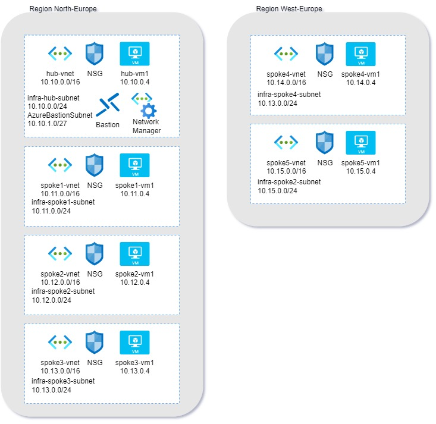

# **Azure Virtual Network Manager MicroHack**

Welcome to the Azure Virtual Manager Microhack

## Contents

[**Introduction**](#introduction)

[**Pre-requisites**](#pre-requisites)

[**The Microhack Objectives**](#objectives)

[**Microhack Overview**](#microhack-overview)

[**Challenge 1 Deploy AVNM Landscape**](#challenge-1---deploy-and-verify-the-microhack-landingzone)

[**Challenge 2: Create Network groups**](#challenge-2-create-network-groups)

[**Challenge 3: Create Hub-Spoke topology**](#challenge-3-create-hub-spoke-topology)

[**Challenge 4: Create Global Mesh Topology**](#challenge-4-create-global-mesh-topology)

[**Challenge 5: Security Admin Configuration**](#challenge-5-security-admin-configuration)

[**Cleanup of resources**](#Cleanup-of-resources)

[**Final Word**](#Final-Word)

## Introduction

Azure Virtual Network Manager (AVNM) is a management service that enables you to group, configure, deploy, and manage virtual networks globally across subscriptions. With Virtual Network Manager, you can define network groups to identify and logically segment your virtual networks. Then you can determine the connectivity and security configurations you want and apply them across all the selected virtual networks in network groups at once.

AVNM is a very powerful component within the Azure Networking suite. To manage Azure VNet's at scale in different architecture patterns AVNM should be a core component in the Azure network foundation of any customer.

AVNM is therefore a great solution to manage network topologies and security:

- **Hub-Spoke topology** A common deployment pattern recommended when you're deploying central infrastructure services in a hub virtual network that are shared by spoke virtual networks. This topology can be more efficient than having these common components in all spoke virtual networks.  

- **(Global) mesh topology** another common deployment pattern: all virtual networks have direct connectivity with each other. They don't need to go through other hops on the network to communicate. Mesh topology is useful when all the virtual networks need to communicate directly with each other.

But also new concepts are introduced by AVNM:

- **Network Groups** A network group is global container that includes a set of virtual network resources from any region. Then, configurations are applied to target the network group, which applies the configuration to all members of the group. A virtual network can be set to join a network group in multiple ways. The two types are group memberships are *static* and *dynamic* memberships.

- **Direct Connectivity**
Enabling Direct connectivity creates an overlay of a connected group on top of your hub and spoke topology, which contains spoke virtual networks of a given group. Direct connectivity allows a spoke VNet to talk directly to other VNets in its spoke group, but not to VNets in other spokes.
For example, you create two network groups. You enable direct connectivity for the Production network group but not for the Test network group. This set up only allows virtual networks in the Production network group to communicate with one another but not the ones in the Test network group.

- **Security admin rules** A security admin configuration contains a set of rule collections. Each rule collection contains one or more security admin rules. You then associate the rule collection with the network groups that you want to apply the security admin rules to. These security rules have a higher priority than network security group (NSG) rules and will get evaluated before NSG rules. Also note that security admin rules don't change your NSG rules.

see [AVNM overview](https://learn.microsoft.com/en-us/azure/virtual-network-manager/overview "AVNM Overview") documentation for more info.

For a deep dive of AVNM I recommend to watch the youtube video from my esteemed colleague John Savill, [Azure Virtual Network Manager Deep Dive](https://youtu.be/qNn83S55WHQ)

## Objectives
The purpose of this microhack is it to get familiar with, and gain hands-on experience with the new Azure Virtual Network Manager (AVNM). Although AVNM is still in public preview, features probably won't be changed.
This MicroHack scenario walks through several Azure Virtual Network Manager scenarios. The objective of this Microhack is to actually deploy an AVNM configuration and perform several challenges such as: creating network groups, deploying Hub-Spoke, Mesh, Hub-Spoke with Direct connectivity and security rules with a new concept as 'Always Allow' rules.

The main objective is that after this Microhack you will be able to:

- Know how to build and deploy several Network topologies with AVNM
- Understand the power of AVNM and how this differs from 'classic' Network Management
- Understand how Security admin rules can help you maintain a secure foundation in your VNet topology

## Pre-requisites

Several prerequisites are required:

- To perform this Microhack an Azure subscription is required, if you don't have one, I recommend to start a free Azure subscription with a start credit see [here](https://azure.microsoft.com/en-us/free/search/).
Don't perform these labs in your production environment!

- Having basic knowledge about Azure networking and understanding concepts as Virtual Networks, VNet Peering, Hub-Spoke, mesh patterns, Network Security Groups and security rules as wel as Bastion and VM's is very useful.

- If you run this Microhack in an existing tenant and subscription, make sure you have permission on that subscription to create Azure policies, this is required to create dynamic network groups.

## Microhack Overview

The Microhack consists of a landing zone to accomodate the different challenges, the environment will contain:
- 6 resource groups:
  - 1 Hub RG located in *North Europe* region, with A Vnet 10.10.0.0/16 2 subnets, a Virtual Machine and Azure Bastion.
  - 3 Spoke RG's, Spoke 1 to 3 located in *North Europe* region, with corresponding subnets 10.11.0.0/16, 10.12.0.0/16 and 10.13.0.0/16 each of them configured with a Virtual machine.
    - 2 Spoke RG's, Spoke 4 & 5 located in *West Europe* region with corresponding subnets 10.14.0.0/16 and 10.15.0.0/16
  - You can see that every VNet has a tag location:region (either northeurope or westeurope).
  - In the hub is an Azure Bastion deployed, to establish a secure connection to the Virtual Machines.
  - All spokes are also deployed with a Network Security Group and a Virtual Machine.
  - In the Hub an Virtual Network Manager instance is deployed.

## Challenge 1 - Deploy and verify the Microhack Landingzone
### Goal ###
The goal of this challenge is to deploy the microhack landing zone. Now this might be an easy task as we provide a Terraform deployment of the landing zone for you. The challenge is to deploy this Terraform code in your tenant that will build the Lab environment.

### Actions ###
There are two tasks to complete in this challenge:
- Task 1: Deploy the Microhack Landing zone.
- Task 2: Verify the deployment and setup.

For Task 1, You need to deploy the TF code in your tenant.
For Task 2, Check the landing zone as described in [Microhack Overview](#microhack-overview)

### Learning Resources 
https://learn.microsoft.com/en-us/azure/devops/repos/git/clone?view=azure-devops&tabs=git-command-line

https://developer.hashicorp.com/terraform/cli/commands

### Sucess Criteria
You have succesfully completed this challenge when:
- You have succesfully deployed the Microhack Landingzone
- You have verified all deployed components

### Challenge 1 Solution - Spoilerwarning
[Solution Steps](./walkthrough/challenge-1/solution.md)

## Challenge 2: Create Network groups
Within Azure Networking the *Network Group* is a new concept, introduced by AVNM.
A network group is global container that includes a set of virtual network resources from any region. Configurations are applied to target the network group, which applies the configuration to all members of the group.

Group membership is a many-to-many relationship, such that one group holds many virtual networks and any given virtual network can participate in multiple network groups. As part of a network group, the virtual network will receive any configurations applied to the group and deployed to the virtual networks region.

A virtual network can join a network group in two types. The two types are group memberships are *static* and *dynamic* memberships.

A *Static* membership means that you manually configure the group by selecting the VNets that need to be added in one group.

A *Dynamic* membership gives you the flexibility of selecting multiple virtual networks at scale if they meet the conditional statements you have defined and based in an Azure Policy. Dynamic membership is useful for scenarios where you have large number of virtual networks, or if membership is dictated by a condition instead of an explicit list (f.i. dynamically group vnets that are based in NorthEurope.)
The advantage of Dynamic groups is the fact that when a new VNet is created that complies to the dynamic group criteria the VNet will be automatically added to that network group (by Azure Policy) and any AVNM configuration this group is member of will be applied.
  
### Goal
This challenge has three goals to achieve:
- Create a *Static* network group.
- Task 2: Create a *Dynamic* network group.
- Task 3: Create a Hub network group, which is a static group with only the Hub network.

Task 3 may seems strange and is not required to build the Hub-Spoke configuration, but is required for Chalenge 4 - Global Mesh Topology.

### Actions 
- Task 1: Deploy a Static Network Group with **Spokes 4 & 5 in West Europe** called *SpokeGroupWE*.
- Task 2: Deploy a Dynamic Network group with **spokes 1 to 3 in North Europe.** called *SpokeGroupNE* while you make use of a policy and name this one *SpokeGroupNEpolicy*.
- Task 3: Create a Static group with only the Hub VNet called *HubGroup*.

### Learning Resources
https://learn.microsoft.com/en-us/azure/virtual-network-manager/concept-network-groups

### Success Criteria
You have achieved this challenge when:
- You have deployed 2 network groups
- One static with spokes 4 & 5 named  *SpokeGroupWE*
- One Dynamic with Spokes 1 to 3 named *SpokeGroupNE*
- A policy for the Dynamic Network group called *SpokeGroupNEpolicy*
- One static network group with only the Hub Vnet called *HubGroup*

### Challenge 2 Solution - Spoilerwarning
[Solution Steps](./walkthrough/challenge-2/solution.md)

## Challenge 3: Create Hub-Spoke topology
Hub and Spoke topology is recommended when you're deploying central infrastructure services (like connectivity, DNS, Bastion, etc) in a hub virtual network that are shared by spoke virtual networks. This topology will be more efficient than having these common components in all spoke virtual networks.

### Goal
In this challenge there are two tasks:
- Task 1: You are going to configure a hub-spoke topology based on the network groups you made in Challenge 2
- Task 2: After creating the configuration, you will deploy the configuration.

### Actions
In AVNM you need to configure a configuration where you select the *Hub VNet* as the Hub, and the two Network groups *SpokeGroupWE* and SpokeGroupNE.
You name this topology *avnmmicrohack-hub-spoke*.
After the creation you can deploy the configuration.

*Note* You can set here an additional configuration:
|Setting | Description |
|-|-|
|Direct Connectivity| Select the checkbox if you want to enable connectivity *within the network group.* This setting allows spoke virtual networks in the network group in the *same region* to communicate with each other directly.|
|Global Mesh| If you want to be able to enable connectivity between network groups and therefore all spokes in *different regions* aka *full mesh*|
|Hub as gateway| If you have deployed a gateway in the Hub (fi. an Virtual Network gateway for S2S VPN or Express Route), you can enable connectivity from spokes to the Gateway (out of scope for this microhack)|

When you have saved your configuration you can proceed to the next step: Deploying it.

### Learning Resources
https://learn.microsoft.com/en-us/azure/virtual-network-manager/concept-connectivity-configuration
https://learn.microsoft.com/en-us/azure/virtual-network-manager/how-to-create-hub-and-spoke
https://learn.microsoft.com/en-us/azure/virtual-network-manager/concept-deployments

### Success Criteria
You have succefully completed this Challenge when:
- You have successfully configured a Hub-Spoke model with the Hub VNet as the Hub and the two network groups as spokes.
- You have successfully deployed the Hub-Spoke configuration
- You have verified the Hub-Spoke config by checking the peerings.

### Challenge 3 Solution - Spoilerwarning
[Solution Steps](./walkthrough/challenge-3/solution.md)

## Challenge 4: Create Global Mesh Topology
Next to a Hub-Spoke model is the (Global) Mesh model.
When a mesh topology is deployed, all virtual networks have direct connectivity with each other. They don't need to go through other hops (such as the Hub) on the network to communicate. Mesh topology is useful when all the virtual networks need to communicate directly with each other.
Mesh networks come in tweo flavors: 

Mesh, means connectivity between spokes in the same region. 

Global Mesh means connectivity between all spokes in all regions.

New with Azure Virtual Network Manager is the fact that Mesh networks won't be reflected in network peerings, the Direct Connect and Mesh configuration is maintained at a lower level.

### Goal
In this challenge there are two tasks:
- Task 1: You are going to configure a Global Mesh topology based on the network groups you made in Challenge 2
- Task 2: After creating the configuration, you will deploy the configuration.

### Actions
In AVNM you need to configure a configuration where you select the Mesh option in the topology and select the *three* Network groups *SpokeGroupWE*, *SpokeGroupNE* and *HubGroup*
You name this topology *avnmmicrohack-global-mesh*.
After the creation you can deploy the configuration.

### Learning Resources
https://learn.microsoft.com/en-us/azure/virtual-network-manager/concept-connectivity-configuration
https://learn.microsoft.com/en-us/azure/virtual-network-manager/how-to-create-mesh-network
https://learn.microsoft.com/en-us/azure/virtual-network-manager/concept-deployments

### Success Criteria
You have successfully achieved this challenge when:
- You have successfully configured a Global Mesh model with 3 network groups
- You have successfully deployed the Global Mesh configuration
- You have verified the Global Mesh config by checking connectivity.

### Challenge 4 Solution - Spoilerwarning
[Solution Steps](./walkthrough/challenge-4/solution.md)

## Challenge 5: Security Admin Configuration
A Security Admin Configuration allows you to enforce security policies on resources that match a rule's condition set. For example, you can define a security admin rule to block network traffic to virtual networks over a high-risk port.
These rules only apply to resources within the scope of the Azure Virtual Network Manager instance.

Security admin rules are evaluated before network security rules. Depending on the type of security admin rule you create, they can interact differently with network security group rules. When this happens, organizations can set enforced security policies alongside the teams' network security groups that address their own use cases. 

The order of evaluation of traffic.

There are three kinds of actions *Allow*, *Always Allow*, and *Deny*. If you create a security admin rule to *Allow* a certain type of traffic, this rule is evaluated first. When a security admin rule allows traffic, it's then evaluated by network security group rules. It leaves room for network security group rules down the line to handle this type of traffic differently as needed. 
If you create a security admin rule to *Always Allow* or *Deny* a certain type of traffic, the rule is evaluated first. Then it terminates the network security group evaluation of this traffic meaning the evaluation is stopped. If the security admin rule is *Always Allow* or *Deny*, the traffic doesn't hit network security groups, and instead delivers directly to virtual machines or other resource. 

### Goal
In this challenge you are going to create a Security Admin rule and deploy these to prevent port 3389 access in West Europe. 
In order to test this you first need to change the configuration back to a hub-spoke model. Then we test that connection on 3389 is possible. Next we create a Security Admin rule and deploy this to the West Europe spokes.
Then we again test if there is connection on port 3389 possible.

### Actions
This challenge has 4 Tasks:
- Task 1: Change network configuration back to Hub-Spoke model.
- Task 2: Check RDP (3389) connectivity.
- Task 3: Create Security Admin Configuration
- Task 4: Deploy Security Admin Configuration

### Learning Resources
https://learn.microsoft.com/en-us/azure/virtual-network-manager/concept-security-admins
https://learn.microsoft.com/en-us/azure/virtual-network-manager/concept-enforcement
https://learn.microsoft.com/en-us/azure/virtual-network-manager/how-to-block-network-traffic-portal

### Success Criteria
You have obtained success if:
- You have changed the network configuration back to Hub-Spoke model.
- You created and deployed a Security Admin Configuration

### Challenge 5 Solution - Spoilerwarning
[Solution Steps](./walkthrough/challenge-5/solution.md)

## Cleanup of resources
To delete the microhack environment return to the Azure cloud shell

- Login to Azure cloud shell https://shell.azure.com/
- Now run `terraform destroy` to start the destruction of the environment

## Final Word
Thank you for trying the Azure Virtual Network Manager, I made this microhack for fun and in my effort to share knowledge and provide a learning experience. if you have any questions or remarks with regards to the Microhack, please feel free to email me at aram.smith@microsoft.com

Special thanks to my dear friend and colleague [Pieterbas Nagengast](https://github.com/PieterbasNagengast) for updating the TF code and work out some quirks. If you into Network topologies check out his Azure Hub-Spoke [LabBuilder](https://github.com/PieterbasNagengast/Azure-HubSpoke-LabBuilder), (now also with Mesh peering).

Thank you.
