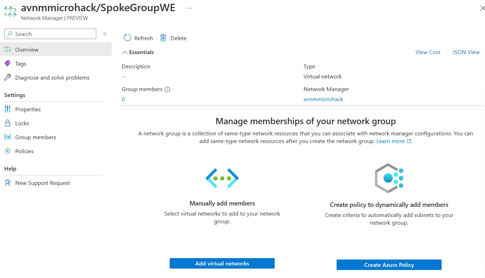
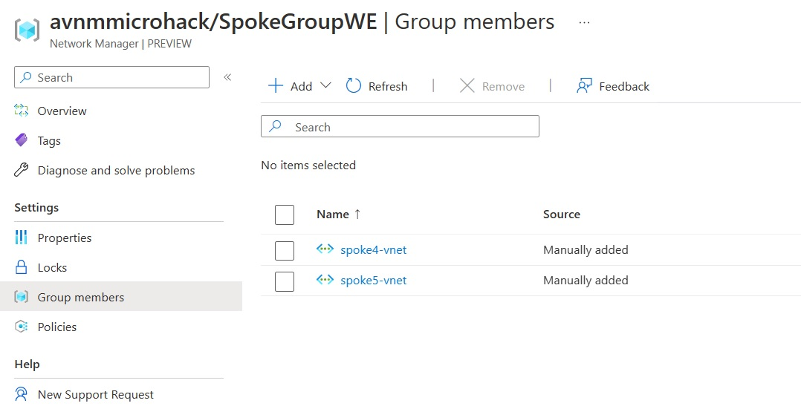
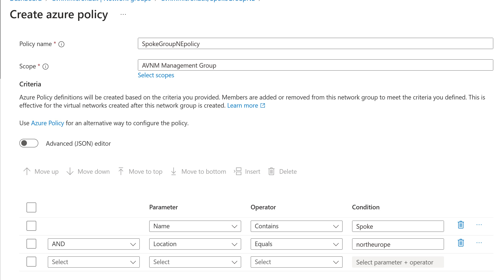
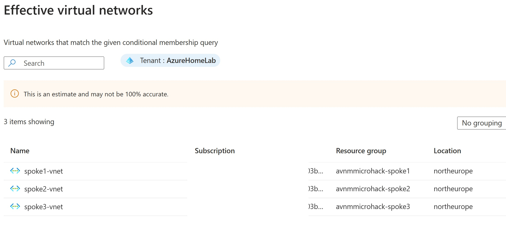
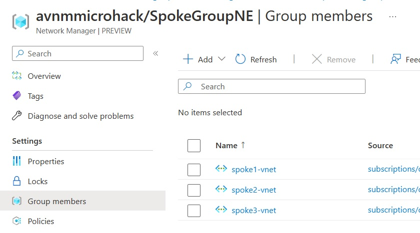
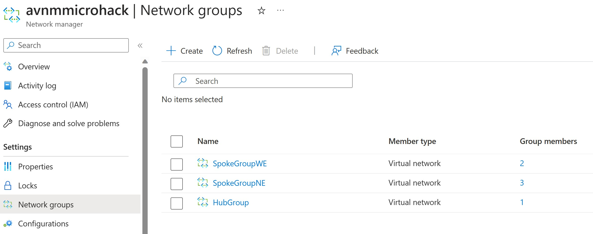

# Walkthrough Challenge 2 - Create Network groups

Duration: 10 minutes

This walkthrough will walk you through the steps to deploy the AVNM Network Groups:

### Task 1: Static Network Group

- In the Network Manager go to the *Network Groups* section and create a new network group named *SpokeGroupWE*.
- Open the new networkgroup by selecting it and select *Add virtual Networks* under the 'Manually add members' section.

- Add Spoke 4 & Spoke 5 as they are based in West Europe.

#### Result

If you look at the *SpokeGroupWE* network group you will see under the column *Group Members* 2 members. If you click on *GroupMembers* you will see the members *Spoke4-vnet* and *Spoke5-vnet*, and that you manually added them.

### Task 2: Dynamic Network Group

As stated before a Dynamic Network group consist of an Azure policy that adds the VNets based on a condition or attribute such as name, tag or other. You need to add all spoke VNet's that are located in North Europe to a Network Group, therefor you define a policy based on name and based on the location tag.

In the Network Manager go to the *Network Groups* section and create a new network group named *SpokeGroupNE*.

Open the new networkgroup by selecting and select *Create Azure Policy* under the 'Create policy to dynamically add members' section.
Now select all spokes that are located in North Europe but *not* the hub-vnet.

- Provide a name to the policy f.i. *SpokeGroupNEpolicy*
- Select Parameter *Name*,  Operator *Contains* and Condition *Spoke*
- Select *AND* Parameter *Location*, Operator *Equals* and Condition *northeurope*

This policy will combine all networks with the word 'Spoke' in their name AND is deployed in the North Europe Region.

- You can check the result by selecting the *Preview Resources*  button and see if the 3 VNets in North Europe will be selected.

- hit *Close* and then *Save* and the Policy will be created.
#### Result

If you look at the *SpokeGroupNE* network group you will see under the column *Group Members* 3 members. If you click on the 3 you will see the members *spoke1-vnet* to *spoke3-vnet*
**If you don't see these members immediately, wait for a few minutes!** (it takes some time before policies apply, hit *refresh* several times).

### Task 3: Hub Static Network Group

Further in this microhack (Challenge 4) you will build a Mesh topology, for that you need to have an additional Static Network Group called *Hub* with only the hub network, this enables you to leverage the Bastion functionality in the Mesh topology.

- In the Network Manager go to the *Network Groups* section and create a new network group named *HubGroup*.
- Open the new networkgroup by selecting it and select *Add virtual Networks* under the 'Manually add members' section.
- Add Hub-Vnet as only member.

#### Result

If you look at the *HubGroup* network group you will see under the column *Group Members* 1 member the Hub-Vnet.
Finaly the configuration of network groups should look like this:

You successfully completed challenge 2! 🚀🚀🚀

You can now proceed with **[Challenge 3](../../README.md#challenge-3-create-hub-spoke-topology)**
