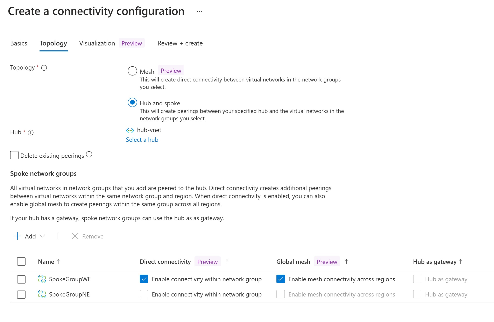
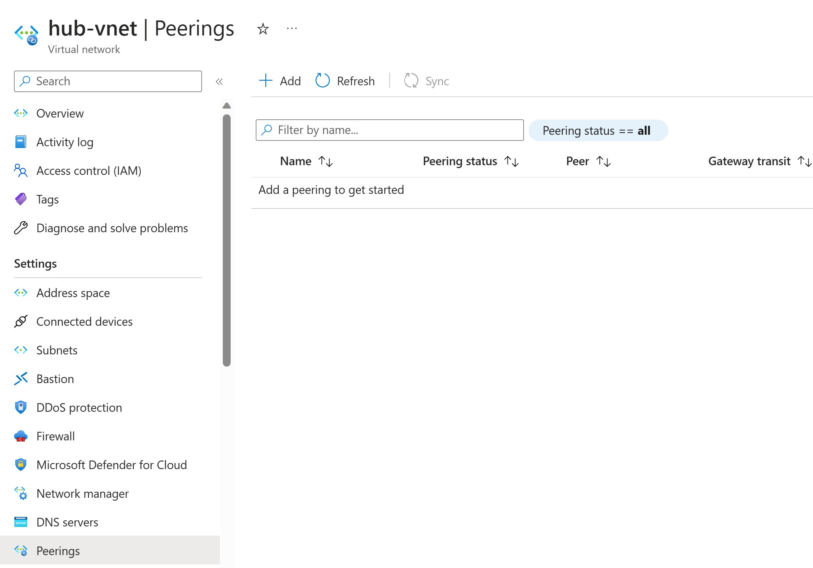
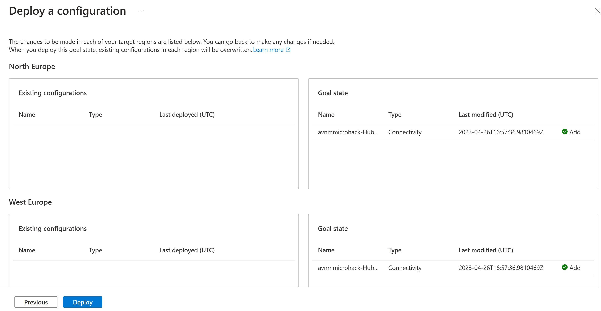
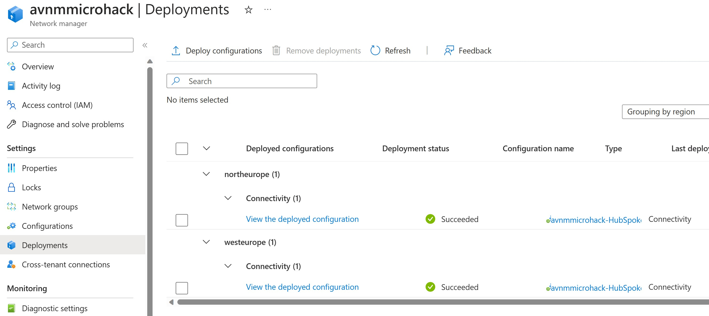
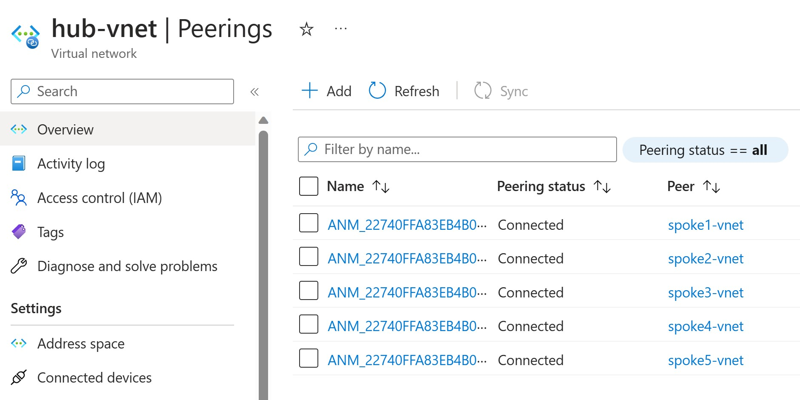
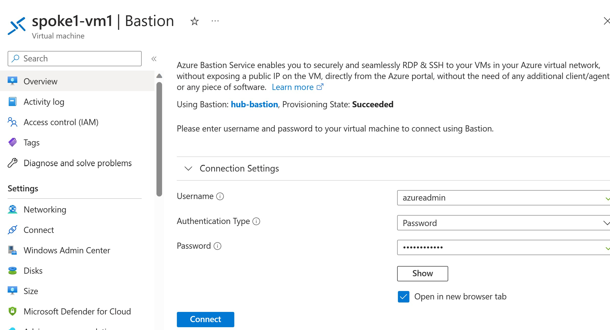

# Walkthrough Challenge 3 - Create and Deploy Hub-Spoke topology

Duration: 10 minutes

This walkthrough will walk you through the steps to create and deploy the Hub-SPoke topology:

### Task 1: Configure the Hub-Spoke topology

In order to deploy a Hub-Spoke topology you first need to create a configuration.

- In the AVNMMicrohack Network manager select *Configurations*
- Select *Create* and select *Connectivity configuration*
- Provide a name: *avnmmicrohack-hub-spoke*
- Select *Next: Topology*
- Select *Hub and Spoke* option
- Select at *Hub* the *Select a hub* link and select the *hub-vnet*
- At the *Spoke Network Groups* section select *Add*
- Select both *SpokeGroupWE* and *SpokeGroupNE* groups (not the HubGroup)

In *Visualizations* you can see a nice overview of the configuration.
- Select *Review and create*

#### Result
You should now have in the *configurations* section a configuration with the name *avnmmicrohack-hub-spoke* with the above configuration.
*Be aware that this is just the configuration, you haven't deployed it yet!*

## Task 2: Deploy Hub-Spoke Configuration
Before you deploy the configuration you can verify that there are no peerings.
This can be checked in two ways:
- Check if there are no existing peerings between hub and spokes by checking then *Peerings* section in the Hub VNet.
- Try to connect with Bastion to spoke VM's which wont work if there are no peerings. 

To check if there are no peering's see the *peerings* section of the *hub-vnet*. This should show no peering's:

Also if you try to connect to spoke1-vm1 through Bastion, you don't get a connection.

To deploy the AVNM Hub-Spoke configuration you do the following:
- In Virtual Network Manager, click on *Deployments*
- Select *Deploy Configurations*
- Select Hub and Spoke Configuration - *avnmmicrohack-hub-spoke*
- Because the Hub & Spoke configuration consists of resources in North- & West Europe please select North and West Europe in the *Target Regions* section

The target configuration should look like this:

- Hit the Deploy button

#### Result
When succesfully deployed it should look like this:

This can be checked by looking at the *Peerings* section in the Hub-Vnet, if deployment was successful you should see the peerings from Hub-Vnet to all other spokes

Now you should also be able to connect from Bastion in the Hub to VM's in the spokes.

You successfully completed challenge 3! 🚀🚀🚀

You can now proceed with **[Challenge 4](../../README.md#challenge-4-create-global-mesh-topology)**
