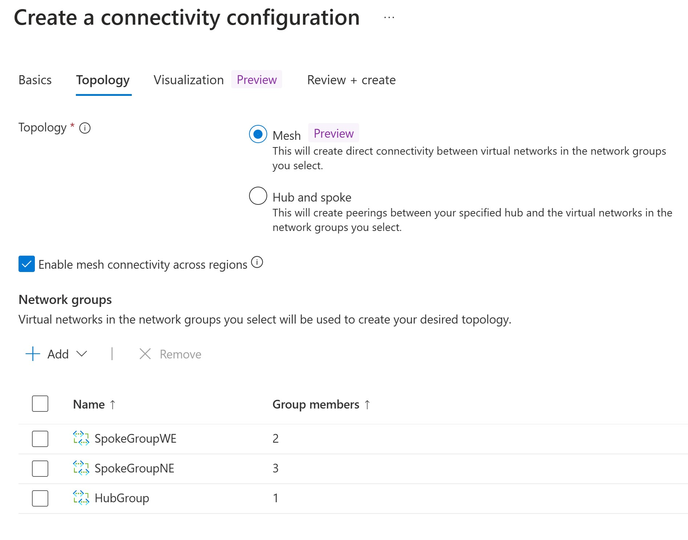
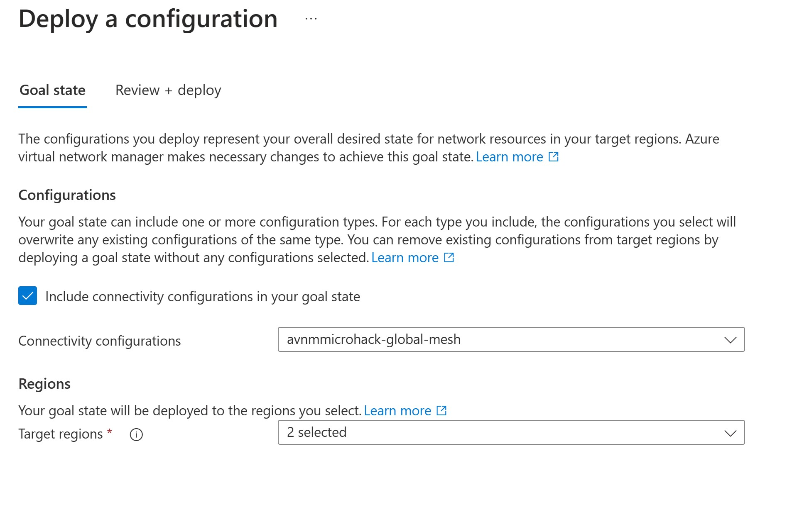
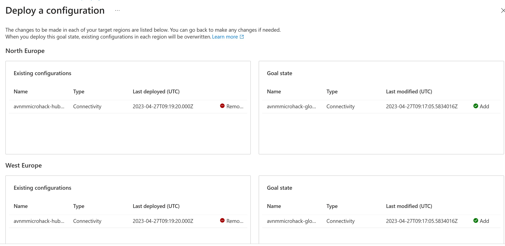
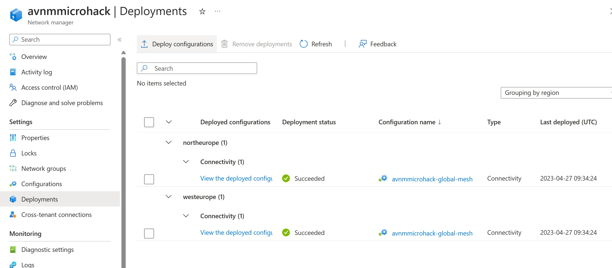
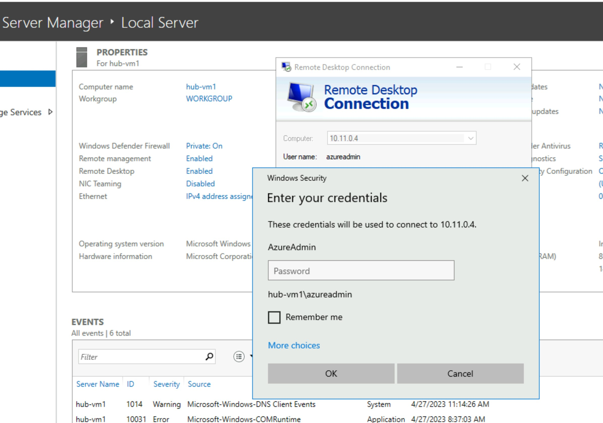

# Walkthrough Challenge 4 - Create and Deploy Global Mesh topology

Duration: 10 minutes

This walkthrough will walk you through the steps to create and deploy the Global Mesh topology:

### Task 1 - Create Global Mesh topology Configuration
In order to deploy a Global Mesh topology you first need to create a configuration.

- In the AVNMMicrohack Network manager select *Configurations*
- Select *Create* and select *Connectivity configuration*
- Provide a name: *avnmmicrohack-global-mesh*
- Select *Next: Topology*
- Select *Mesh* option
- Select *Enable Mesh Connectivity accross Regions*

*By default Mesh connectivity is applied to Virtual Networks in the same region. However you can enable Gobal Mesh by enabling connectivity accross regions.*

- At the *Spoke Network Groups* section select *Add*
- Select All network groups *HubGroup*, *SpokeGroupWE* and *SpokeGroupNE*.

Hit the *Review + Create* button

### Task 2 - Deploy Global Mesh Topology

Although one configuration is deployed, it is possible to change one deployment with a changed or altered deployment.

To deploy the AVNM Global Mesh configuration you do the following:
- In Virtual Network Manager, click on *Deployments*
- Select *Deploy Configurations*
- Select *Connectivity Mesh* Configuration then *avnmmicrohack-global-mesh*
- Because the Mesh configuration consists of resources in North- & West Europe please select North and West Europe in the *Target Regions* section

The target configuration should look like this:

Because there is an existing Hub-Spoke configuration there will be a replacement with the Mesh congfiguration.

In here you can see that the Hub-Spoke config will be replaced with the Global Mesh configuration.

- Hit the *Deploy* button.

#### Result
When successfully deployed it should look like this:

If you look at the peerings from the Hub-Vnet and Spokex-Vnets you will notice these are gone and no peerings exist, although the (global) Mesh connectivity exists.
You can test this by accessing *Hub-VM1* through Bastion and within that server use the Remote Desktop Protocol to establish an RDP connection to the other VM's such as *Spoke1-VM1* 

You successfully completed challenge 4! 🚀🚀🚀

You can now proceed with **[Challenge 5](../../README.md#challenge-5-security-admin-configuration)**
