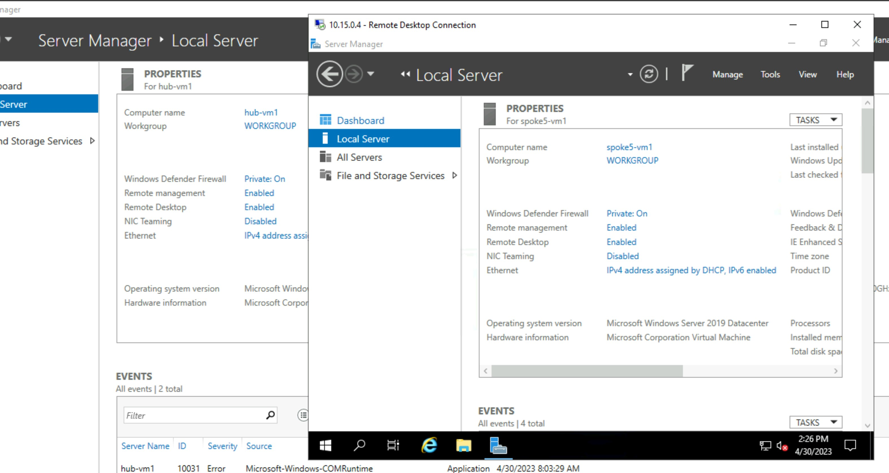
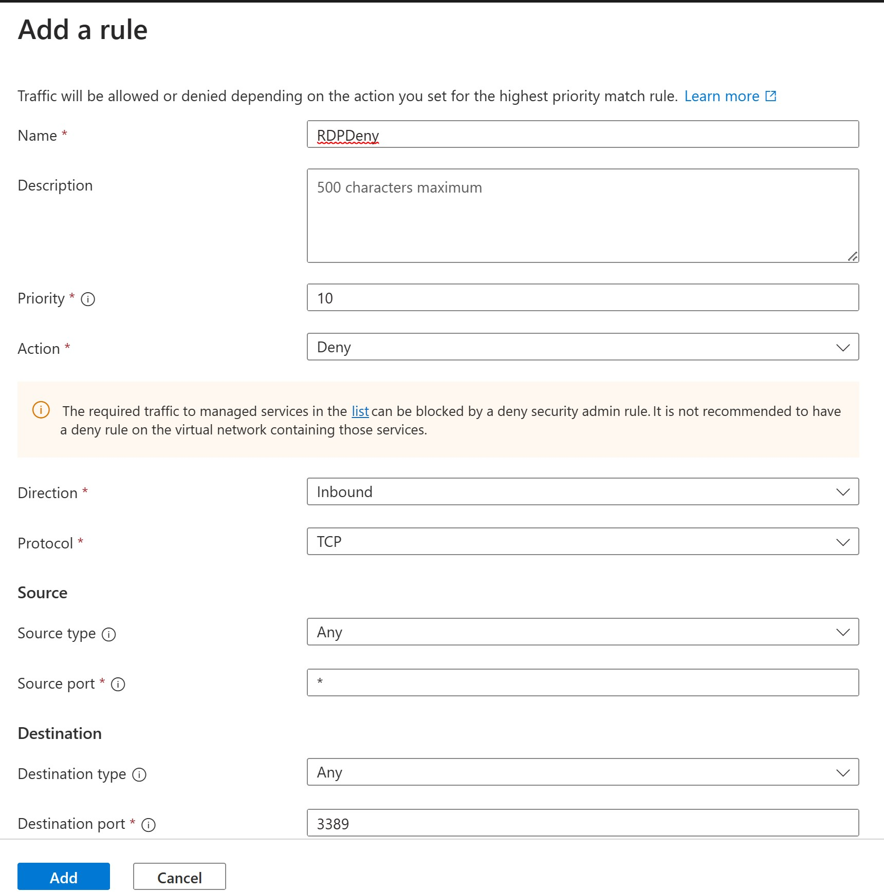
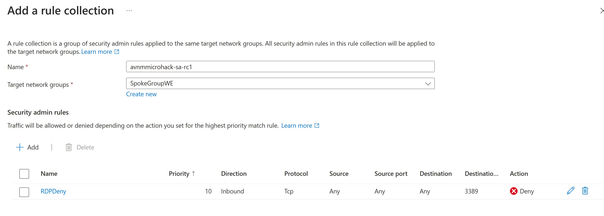
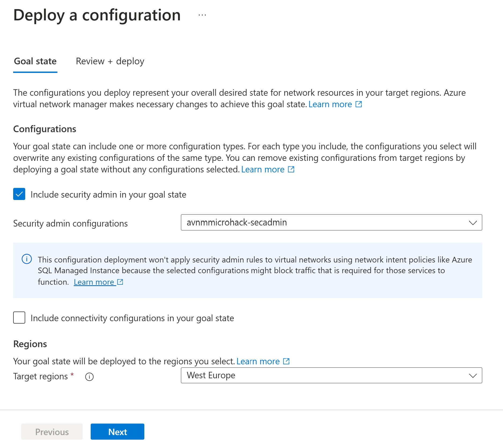
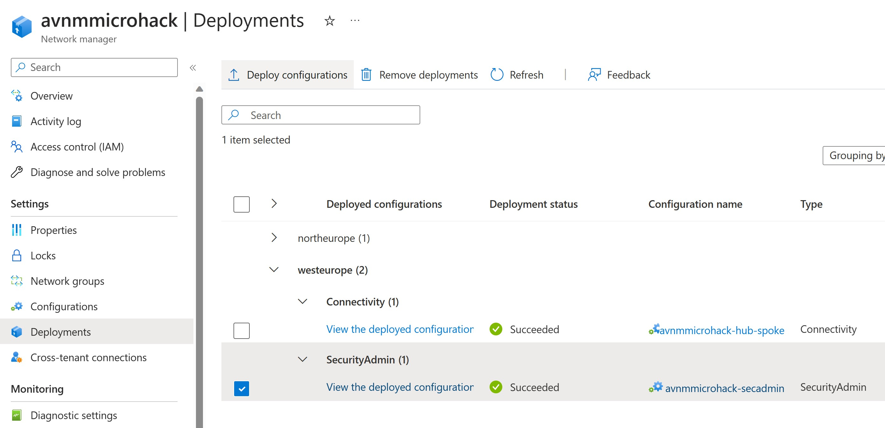
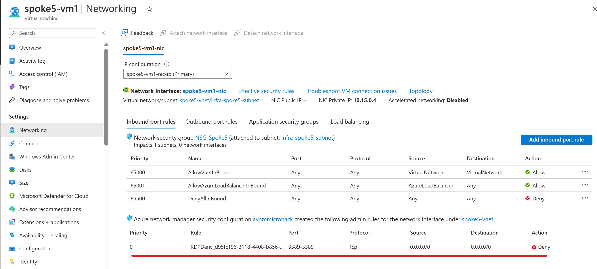
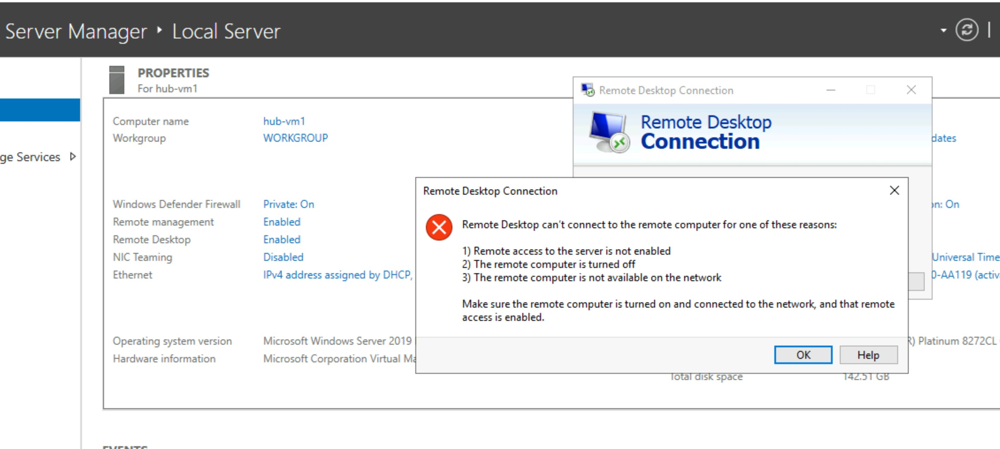

# Walkthrough Challenge 5 - Security Admin Configuration

Duration: 20 minutes

This walkthrough will walk you through the steps to create and deploy an Security Admin configuration:

### Task 1: Change network configuration to Hub-Spoke model.
To be able to test the Security Admin configuration you will use Bastion to connect to the Hub-VM1 from *Hub-VM1* we will connect to the *spoke5vm1* through RDP using port 3389.
Because in our last challenge you deployed a global Mesh topology you need to change the deployment back to Hub-Spoke model.
This will also show how easy it is to switch, extend or change the existing topology.
- In Network Manager select *Deployments*
- The current configuration is shown by its *Configuration Name* and should be *avnmmicrohack-global-mesh
- Select *Deploy Configurations* and select *avnmmicrohack-hub-spoke* and select *West Europe* and *North Europe*
- Check the Existing and Target configuration (avnmmicrohack-global-mesh will be removed and avnmmicrohack-hub-spoke will be deployed.)
- Select *Deploy*

### Task 2: Check RDP (3389) connectivity.
To check your Security Admin deployment later, you first need to check RDP connectivity. Perform the following steps:

- In the *avnmmicrohack-hub* resourcegroup Select the *Hub-VM1* VM and click on *Connect*
- Select Bastion, Provide username (AzureAdmin) and your Password (you specified during deployment).
- The browser will open a new tab with the Hub-VM1 desktop.
- Start the *Remote Desktop Connection* application.
- Provide the IP address of the *spoke5-vm1* server (10.15.0.4)
- Select in *Options* and *Display* a resolution of 800x600
- Hit *Connect*

The RDC client will ask for the username and password of the *spoke5-vm1* server (which is the same as for the hub-vm1 server).

#### Result
Result should something like this:

You have made succesfully a connection from the *Hub-VM1* server to the *Spoke5-VM1* server through RDP.

- Close the RDP connection.

### Task 3: Create Security Admin Configuration
The next step is to create a Security Admin Configuration.

- In Network Manager select *Configurations*
- Select *Security Admin Configuration*
- Provide a name for the configuration like *avnmmicrohack-secadmin*
- Hit *Next* and select ad *Rule Collections* select *Add*
- Provide a name for the rule collection like *avnmmicrohack-sa-rc1*
- Select at the *Target Network Groups* only *SpokeGroupWE*
- Next at *Security Admin Rules* select *Add*
- The *Add Rule* blade will emerge.
- Add the following parameters:

- Hit *Add*

You can make additional rules in this ruleset if required.

#### Result
The result should look like this:

- Hit *Add* and *Review and Create*
You can check that in Network Manager *Configurations* an additional *Security - Admin Rules* configuration is added.

### Task 4: Deploy Security Admin Configuration
Next step is to deploy the Security Admin Configuration, like you did with the topology configurations.
To do this:

- In Network Manager go to *Deployments*
- Select *Deploy Configurations*
- Now you will see a thick box named *Inlude Security Admin in your Goal state*
- Mark the box
- In the section *Security Admin Configuration* select the *avnmmicrohack-secadmin* configuration
- In the *Regions* section select only *West Europe*

Configuration should look like this:

- Hit *Next*
- check the deployment goal state and hit *Deploy*

#### Result

When the configuration is deployed it should look like this:

Now you can check if the Security Admin Configuration works, you configured a deny on RDP 3389 protocol incoming on the West Europe Network group and therefore all servers that are located in this network group.

The 1st check you can do is look at the *Networking* configuration of the *Spoke5-VM1*
This will show you the additional Security Admin Rule that applies to that VM:

You can see the additional deny rule on port 3389.

The 2nd check is to actually establish an RDP connection.
- We go back to the tab with the *Hub-VM1* desktop
- Open the Remote Desktop Connection app and try to reconnect to the *Spoke5-VM1* (10.15.0.4)
- If the configuration is properly applied the RDP connection cannot be established.

You successfully completed challenge 5! 🚀🚀🚀

You can now proceed with **[Clean Up the resources](../../README.md#cleanup-of-resources)**
